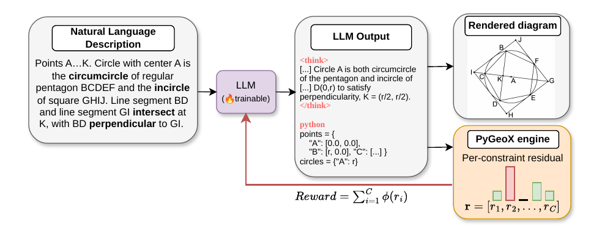
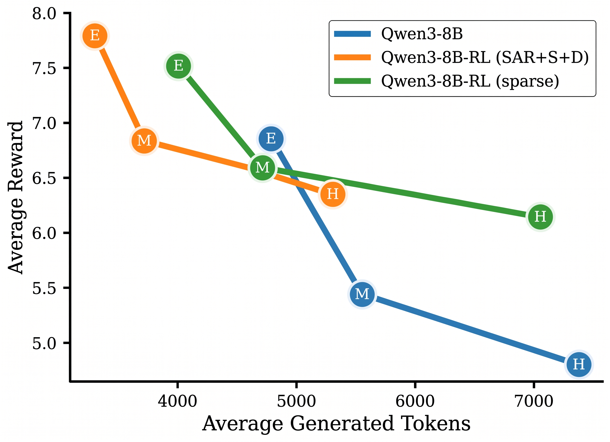
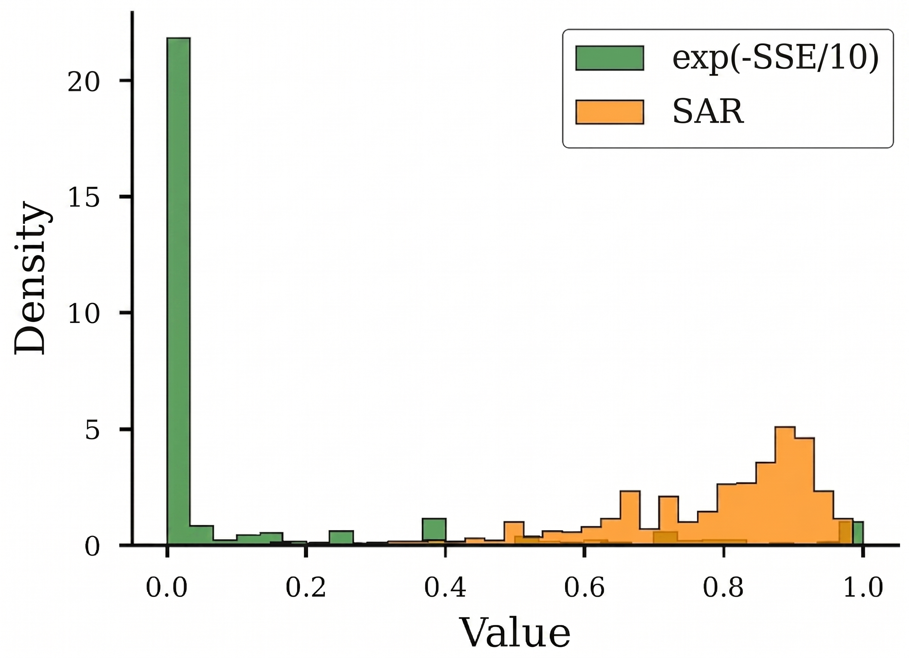
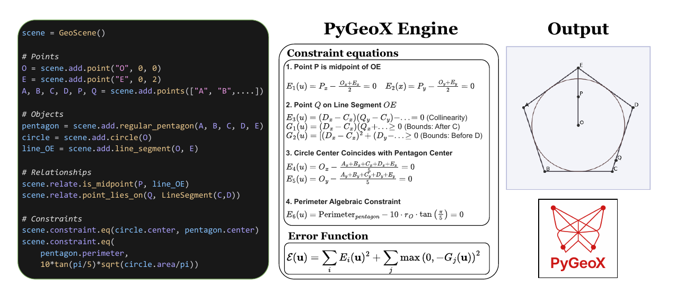
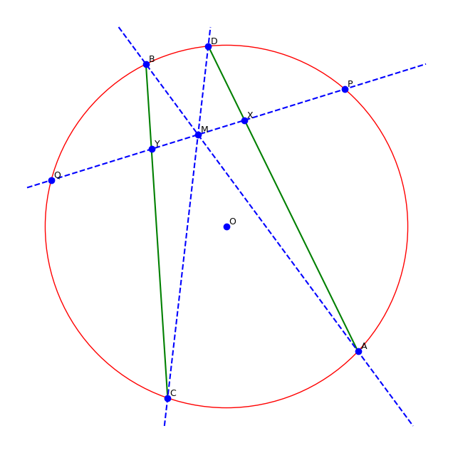

<p align="center">
  
</p>

<p align="center">
  <strong>Internalizing Geometric Law: a geometry language for precision-critical LLM generation</strong>
</p>

<p align="center">
  <a href="https://arxiv.org/abs/2606.09278"></a>
  ·
  <a href="docs/_build/html/index.html"></a>
  ·
  <a href="https://huggingface.co/datasets/rafaelcabral96/PyGeoX"></a>
  ·
  <a href="LICENSE"></a>
</p>


## Why PyGeoX?

LLMs are strong at *language* but brittle at *geometry*. A diagram can read perfectly in prose yet violate tangency, parallelism, or a length constraint by millimeters, or by miles. In **technical diagramming, CAD, and kinematic mechanism design**, that gap is not cosmetic:

> *A generated technical diagram might look plausible, but if it connects two components with a physically impossible linkage, it constitutes more than a simple hallucination. It represents a critical functional failure.*
> <br/><sub>from *Internalizing Geometric Law*</sub>

These problems converge on a single core challenge: **geometry constraint solving (GCS)**, finding a configuration of entities that satisfies dozens of interacting relations at once. Bridging this requires a formal language where geometric constraints can be precisely specified and algorithmically resolved.


1. **Relationships are flexible.** Not a fixed theorem-prover vocabulary, but rich objects (polygons, incircles, inequalities) and declarative relations (parallel, tangent, "line AB longer than CD", ...).
2. **Correctness is measurable.** Every relation compiles to a **residual** \(r_i \geq 0\); together they form an **error function** \(\mathcal{E}(\mathbf{u})\) over coordinates \(\mathbf{u}\) you can minimize, visualize, and differentiate through.

**PyGeoX** is that representation: a lightweight, object-oriented Python **DSL** that compiles geometric intent into symbolic constraints, aggregates them into a single error funciton, and exposes **per-constraint residuals**. One engine serves two LLM workflows:

- **Diagram synthesis.** An LLM converts an informal geometry description into PyGeoX DSL code. PyGeoX then solves that scene, for a valid coordinate assignment and returns the **exact coordinates and a rendered image**.
- **Reward for RL.** The same residuals become **dense reward signals**, so an agent learns GCS **natively** in code (`numpy`, `scipy`, `sympy`) instead of outsourcing spatial reasoning to an opaque solver API. PyGeoX runs **off-policy**, scoring whether the emitted coordinates actually satisfy the scene.

<p align="center">
  
</p>
<p align="center"><em>Task overview (from the paper): the agent reasons in code and outputs exact coordinates and radii; PyGeoX verifies each constraint independently.</em></p>

GCS problems are **under-constrained** (many valid placements up to similarity transforms, like rotation and scaling), so you cannot grade with a single ground-truth coordinate file. PyGeoX instead asks: *by how much is each geometry constraint violated?* That continuous manifold is what makes **partial credit** possible, enabling dense rewards and better reinforcement learning pipelines.

---

## Main results

**Saturating Additive Rewards (SAR)** sum bounded per-constraint kernels so progress on satisfied constraints survives even when others fail. Compared to global-norm (MSE / SSE) rewards, SAR improves hard-tier solving rate by **2.3×** on PyGeoX-Bench; composite **SAR+S+D** (dense shaping + sparse success + degeneracy penalty) is our default training reward.

<p align="center">
  
    
</p>
<p align="center">
  <em>Left: Dense RL reaches higher reward with fewer tokens.</em><br/>
  <em>Right: SAR spreads reward over [0, 1]; exp(−SSE) collapses to a sparse near-binary distribution.</em>
</p>


---

## Repository overview

| | Path | Role |
|---|------|------|
| **Geometry language** | [`pygeox/`](pygeox/) | 35+ objects, 38+ relationships, symbolic + numeric solvers, reward API |
| **Data** | [`data/`](data/) | PyGeoX-Bench JSON, PyGeoX-Wild, teacher traces, RL/SFT JSONL |
| **Training** | [`model_training/`](model_training/) | GRPO (Qwen 1.7B Unsloth, Qwen 8B OpenRLHF), SFT (Swift), reward functions |
| **Evaluation** | [`model_testing/`](model_testing/) | Benchmark drivers, `generations/`, metrics in `excells/` |
| **Paper & figures** | [`arxiv/`](arxiv/) | LaTeX source and figure assets |
| **Plots** | [`plots/`](plots/) | Analysis scripts and result figures |

---

## PyGeoX engine

<p align="center">
  
</p>
<p align="center"><em>Declarative scene (left) → symbolic constraints (middle) → aggregated error for optimization &amp; RL (right).</em></p>

PyGeoX implements a **declarative → symbolic → differentiable** pipeline:

- **Declare** objects and relationships in readable Python (`scene.add.triangle`, `scene.relate.tangent`, …).
- **Compile** each relation to equalities \(E_i = 0\) or inequalities \(G_i > 0\) via SymPy.
- **Evaluate** residuals with Numba-accelerated numeric kernels for fast reward batches during RL.

### Install & quick start

```bash
git clone <repository-url>
cd PyGeoX-cleaned
pip install -r requirements.txt
pip install -e .
```

```python
from pygeox import GeoScene

scene = GeoScene(10)
A, B, C = scene.add.points(['A', 'B', 'C'])
triangle = scene.add.triangle(A, B, C)
circle = scene.add.circle(center=A, radius=5)

scene.relate.parallel(line_AB, line_CD)
scene.relate.point_lies_on(P, circle)

scene.solver.numerical(method="basinhopping")
scene.plot()
```

**Highlights:** 37 object types · 27 relationships · automatic constraints · symbolic & numerical solvers · dense reward from residuals

### Construct *and* prove

PyGeoX is not only a solver. Mark a conclusion with `scene.proving()` and the built-in prover certifies it symbolically from the stated hypotheses.

<table>
<tr>
<td width="48%" valign="top">

> **Butterfly theorem.** M is the midpoint of chord PQ; chords AB and CD pass through M; AD and BC meet PQ at X and Y. Prove that M is the midpoint of XY.

```python
with scene.proving():
    scene.relate.is_midpoint(M, LineSegment(X, Y))

scene.solver.numerical(distance_penalty=0.01)
scene.prove()
# Conclusion: 2*x_M - x_X - x_Y = 0
# Verdict:    PROVEN TRUE
```

</td>
<td width="52%" valign="top">



</td>
</tr>
</table>

Full walkthrough in the [examples](docs/_build/html/examples.html#diagram-construction-proof-problem-butterfly-theorem).

---

## Reproduce the paper

Data generation and model calls read an `API_KEY` (and optional `OPEN_AI_BASE_URL`) from a `.env` at the repo root.

**Data.** PyGeoX generates ~100k validated 4-tuples (*description · DSL code · per-constraint reward · image*), stratified Easy / Medium / Hard into two corpora: **PyGeoX-CodeGen-SFT** (NL → code) and **PyGeoX-GCS-RL** (NL → scene for rewards). Build them with [`data_generation_pipeline.py`](pygeox/synthetic/data_generation_pipeline.py) → [`prepare_data.ipynb`](model_training/prepare_data.ipynb). 


Alternatively, download the released datasets from the **[🤗 Hugging Face Hub](https://huggingface.co/datasets/rafaelcabral96/PyGeoX)**. Fetch and prepare everything with [`data/load_pygeox.py`](data/load_pygeox.py) (`python data/load_pygeox.py --root ./PyGeoX`), or stream a split via `load_dataset("rafaelcabral96/PyGeoX", "gcs-rl")`.

**Benchmarks.** [`PyGeoX-Bench`](model_testing/PygeoX-Bench/) (300 procedural, 100 × E/M/H) and [`PyGeoX-Wild`](model_testing/PyGeoX-Wild/) (200 OOD school-geometry problems). Outputs land in `generations/<model>/`, aggregates in `excells/`.

**Training.** GRPO on Qwen 1.7B ([Unsloth](model_training/unsloth_qwen1.7B/)), plus RL + SFT on Qwen 8B ([OpenRLHF / ms-swift](model_training/run_commands/)). The 8B reward ablation from the paper:

| Reward | Reward fn | RL | SFT |
|--------|-----------|-----|-----|
| **SAR+S+D (ours)** | `reward_func_sar_sd.py` | `rl_sar_sd.sh` | `sft_sar_sd.sh` |
| SAR | `reward_func_sar.py` | `rl_sar.sh` | `sft_sar.sh` |
| Sparse | `reward_func_sparse.py` | `rl_sparse.sh` | `sft_sparse.sh` |
| MSE | `reward_func_mse.py` | `rl_mse.sh` | `sft_mse.sh` |
| MSE+S+D | `reward_func_mse_sd.py` | `rl_mse_sd.sh` | `sft_mse_sd.sh` |

---

## Citation

If you use PyGeoX or PyGeoX-RL, please cite:

```bibtex
@article{cabral2026internalizinggeometriclaw,
  title={Internalizing Geometric Law: Learning from Solver Residuals for Precision-Critical Generation},
  author={Cabral, Rafael and Pang, Zixi and Shou, Ziyi and Xin, Shen},
  journal={arXiv preprint arXiv:2606.09278},
  year={2026}
}
```