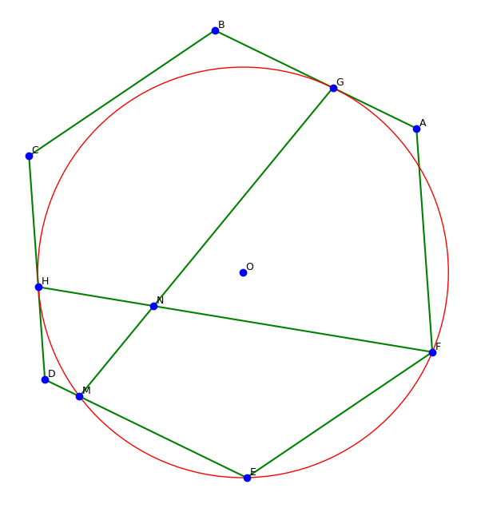
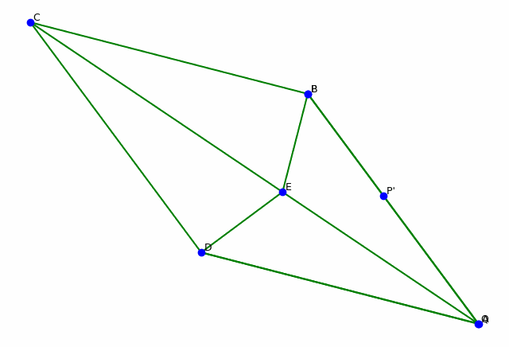

# Examples


## Diagram construction + calculation problem

Problem: In a regular hexagon ABCDEF, a circle O passing through points E and F is tangent to sides AB and CD at points G and H, respectively, and intersects side DE at point M. Lines GM and FH intersect at point N, the measure of angle ∠GNF is ___°.

```python
from pygeox import GeoScene, LineSegment

scene = GeoScene(10)

A, B, C, D, E, F, G, H, M, N, O = scene.add.points(["A", "B", "C", "D", "E", "F", "G", "H", "M", "N", "O"])

# In a regular hexagon ABCDEF
hexagon = scene.add.regular_hexagon(A, B, C, D, E, F)

# a circle O passing through points E and F
circle = scene.add.circle(O)
scene.relate.points_lie_on([E, F], circle)

# tangent to sides AB and CD at points G and H
scene.relate.tangent_to_circle(LineSegment(A,B), circle, G)
scene.relate.tangent_to_circle(LineSegment(C,D), circle, H)

## intersects side DE at point M
scene.relate.line_intersects_circle_at(LineSegment(D,E), circle, M)

## Lines GM and FH intersect at point N
Line_GM = scene.add.line_segment(G, M)
Line_FH = scene.add.line_segment(F, H)
scene.relate.lines_intersect_at(Line_GM, Line_FH, N)

scene.solver.numerical()
scene.plot()
```



The function `scene.solver.numerical()` finds one of possibly many valid configurations for the diagram. After, we can call any object property to find its numerical value.

```python
# the measure of angle ∠GNF is ___°
scene.angle(G,N,F).evalf(4) 
#60
```

---


## Diagram construction + proof problem (Butterfly theorem)

Problem: Let M be the midpoint of a chord PQ of a circle, through which two other chords AB and CD are drawn; AD and BC intersect chord PQ at X and Y correspondingly. Prove that M is the midpoint of XY.

```python
from pygeox import GeoScene, LineSegment


scene = GeoScene(5)

M, P, Q, A, B, C, D, X, Y, O = scene.add.points(["M","P","Q","A","B","C","D","X","Y","O"])

# Let M be the midpoint of a chord PQ of a circle, through which two other chords AB and CD are drawn
circle = scene.add.circle(O)
l_AB = scene.add.chord(circle, A, B)
l_CD = scene.add.chord(circle, C, D)
l_PQ = scene.add.chord(circle, P, Q)
scene.relate.is_midpoint(M, l_PQ)
scene.relate.point_lies_on(M, l_CD)
scene.relate.point_lies_on(M, l_AB)

# AD and BC intersect chord PQ at X and Y correspondingly
l_AD = scene.add.line_segment(A,D)
l_BC = scene.add.line_segment(B,C)
scene.relate.lines_intersect_at(l_AD, l_PQ, X)
scene.relate.lines_intersect_at(l_BC, l_PQ, Y)

# Then M is the midpoint of XY.
with scene.proving():
    scene.relate.is_midpoint(M, LineSegment(X,Y))

scene.solver.numerical(distance_penalty=0.01)
scene.plot()
```


Our built-in prover can prove "M is the midpoint of XY" based on the stated conditions.

```python
scene.prove()
#Conclusion: 2*x_M - x_X - x_Y = 0
#Final Remainder: 0
#Verdict: PROVEN TRUE. The conclusion is a consequence of the hypotheses.

#Conclusion: 2*y_M - y_X - y_Y = 0
#Final Remainder: 0
#Verdict: PROVEN TRUE. The conclusion is a consequence of the hypotheses.

```

---

## Dynamic geometry with animation: two moving points

Problem: In the rhombus ABCD, draw line segment DE perpendicular to CD, where E is the point of intersection with diagonal AC. Connect BE. Point P is a moving point on segment BE, and construct the symmetry point P' of point P with respect to line DE. Point Q is a moving point on diagonal AC, connecting PQ and DQ. If AE equals 14 and CE equals 18, then the maximum value of DQ - P'Q is ___.

```python
from pygeox import GeoScene, LineSegment

# Create a new scene
scene = GeoScene(5)

# add objects
A, B, C, D, E, P, Q = scene.add.points(["A","B","C","D", "E", "P", "Q"])

# In the rhombus ABCD
scene.add.rhombus(A,B,C,D)

# draw line segment DE perpendicular to CD
line_DE = scene.add.line_segment(D,E)
line_CD = scene.add.line_segment(C,D)
scene.relate.perpendicular(line_DE, line_CD)

#where E is the point of intersection with diagonal AC
line_AC = scene.add.line_segment(A,C)
scene.relate.point_lies_on(E, line_AC)

#Connect BE
line_BE = scene.add.line_segment(B,E)

#Point P is a moving point on segment BE
scene.animate.point_sweep_line(point = P, start_point = B, end_point = E)

#construct the symmetry point P' of point P with respect to line DE
Ps = scene.add.point("P'", copy = P.mirror_across_line(line_DE))

#Point Q is a moving point on diagonal AC, connecting PQ and DQ
scene.animate.point_sweep_line(point = Q, start_point = A, end_point = C)
line_PQ = scene.add.line_segment(P,Q)
line_DQ = scene.add.line_segment(D,Q)

# If AE equals 14 and CE equals 18
scene.constraint.eq(LineSegment(A,E).length, 1.4) # use small numbers 14 -> 1.4 
scene.constraint.eq(LineSegment(C,E).length, 1.8) # use small numbers 18 -> 1.8 


#run animation
scene.animate.run(moving_points= [P, Ps, Q], opt_method = "dual_annealing", frames = 32) 
#when default optimizer fails, use basinhoping -> slower but it works better
scene.animate.gif(total_time=10) 
```




